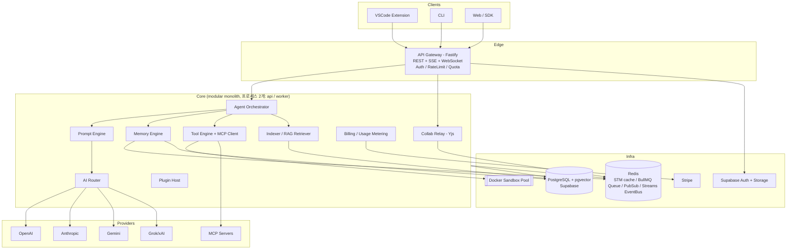

# 1. 전체 시스템 아키텍처

## 1.1 시스템 개요

AIOS는 "AI 운영체제"다. OS의 비유를 그대로 설계에 반영했다:

| OS 개념 | AIOS 대응물 | 이유 |
|---|---|---|
| 커널 | Agent Orchestrator | 모든 요청이 통과하는 단일 실행 루프. 스케줄링(라우팅)·메모리·I/O(도구)를 중재 |
| 프로세스 스케줄러 | AI Router | 어떤 모델이 CPU(추론 자원)를 받을지 결정 |
| 가상 메모리 | Memory Engine | STM(RAM=Redis) / LTM(디스크=pgvector) 계층 |
| 시스템 콜 | Tool Engine + MCP | 권한 검사를 거쳐야만 외부 세계에 닿는 유일한 통로 |
| 파일시스템 | Codebase Indexer | 코드를 주소화(청크+임베딩)해서 조회 가능하게 만듦 |
| 디바이스 드라이버 | Provider Adapter | OpenAI/Claude/Gemini/Grok의 이질적 API를 단일 인터페이스로 |
| 유저랜드 앱 | Plugin System | 커널 API(capability) 위에서만 동작하는 서드파티 코드 |

## 1.2 토폴로지

## 1.3 핵심 아키텍처 결정과 이유

### 결정 1: Modular Monolith → 나중에 분리
마이크로서비스로 시작하지 않는다. 패키지 경계(`packages/ai`, `packages/memory`, `packages/tools`, `packages/indexer`)를 서비스 경계처럼 엄격하게 유지하되, 배포 단위는 **api / worker 두 프로세스**로 시작한다.

- 이유 1: 초기 단계의 최대 리스크는 스케일이 아니라 제품-시장 적합성. 분산 시스템 복잡도(분산 트랜잭션, 서비스 디스커버리, 관측성)는 지금 지불할 비용이 아니다.
- 이유 2: 패키지 간 통신을 이미 EventBus/Queue로 강제해 두었으므로, 트래픽이 증가하면 `indexer`와 `sandbox`부터 물리적으로 떼어낼 수 있다(12장 Scaling 참조). 경계는 지금, 분리는 나중에.
- 이유 3: LLM 앱의 병목은 우리 코드가 아니라 프로바이더 추론 시간이다(14장 병목). 마이크로서비스로 얻는 수평 확장성이 병목을 해결해 주지 않는다.

### 결정 2: 벡터DB = pgvector (전용 벡터DB 대신)
- 이유 1: 코드 청크와 메타데이터(파일 경로, 프로젝트, 권한)를 **한 트랜잭션/한 조인**으로 다룬다. 전용 벡터DB를 쓰면 Postgres와의 이중 쓰기 일관성 문제가 생긴다.
- 이유 2: HNSW 인덱스 기준 수천만 벡터까지 p95 <100ms 달성 가능. 우리 워크로드(프로젝트당 수만~수십만 청크, 쿼리는 project_id로 파티셔닝됨)는 전역 검색이 아니라 좁은 필터 검색이라 pgvector에 유리하다.
- 이유 3: Supabase가 pgvector를 기본 제공 → 운영 부담 0. 탈출 경로: 5천만 벡터 초과 시 Qdrant로 이관하는 어댑터 인터페이스(`VectorStore`)를 유지한다.

### 결정 3: Redis 하나로 STM + Queue + PubSub + EventBus
- STM(단기 기억): TTL·리스트 연산이 자연스럽고 p99 <1ms.
- Queue: BullMQ(Redis 기반) — 인덱싱·요약·과금 집계 같은 백그라운드 작업. Kafka는 현 규모에서 운영 과잉.
- EventBus: Redis Streams + consumer group — at-least-once 전달, 컨슈머 장애 시 XAUTOCLAIM으로 재처리. 규모가 커지면 NATS JetStream으로 교체 가능하도록 `EventBus` 인터페이스 뒤에 숨긴다.
- 이유: 인프라 구성 요소 수가 곧 온콜 부담이다. 단계적 확장 시 Redis Cluster로 수직 성장 가능.

### 결정 4: LLM 프로바이더는 공식 SDK 대신 raw HTTP + 자체 SSE 파서
- 이유 1: 4개 SDK의 버전·타입·스트리밍 추상화가 제각각이라, SDK 위에 또 어댑터를 얹으면 이중 추상화가 된다. REST 표면은 안정적이고 얇다.
- 이유 2: 스트리밍 정규화(`StreamEvent`)와 폴백(스트림 중간 실패 처리)을 우리가 완전히 제어해야 한다. SDK 내부 재시도 로직은 라우터의 서킷브레이커와 충돌한다.
- 이유 3: Grok(xAI)은 OpenAI 호환 API라서 어댑터 상속으로 코드 중복 없이 지원된다.

### 결정 5: 실시간 협업은 서버가 "멍청한 릴레이"
Yjs CRDT 업데이트를 서버는 해석하지 않고 Redis PubSub으로 릴레이만 한다.
- 이유: CRDT의 수렴 보장은 클라이언트 측 병합으로 충분하다. 서버가 문서 상태를 이해하려 들면 WS 노드가 상태ful해지고 수평 확장이 어려워진다. 스냅샷 영속화만 주기적 잡으로 처리.

### 결정 6: OAuth/스토리지는 Supabase에 위임
- 이유: 인증(OAuth 플로우, 토큰 갱신, MFA)은 미분화 중노동(undifferentiated heavy lifting). Supabase Auth의 JWT를 우리 게이트웨이가 검증만 하면 된다. 단, **인가(RBAC)는 우리 도메인 로직**이므로 자체 구현(org_members.role).

### 결정 7: 언어 = TypeScript 단일화
- 이유: VSCode 확장은 TS 강제. CLI/SDK/서버를 같은 언어로 하면 타입(`packages/shared`)을 네 표면이 공유한다 — API 계약 드리프트가 컴파일 에러로 잡힌다. 인덱서의 CPU 병목이 실측되면 그 부분만 Rust로 교체(경계가 이미 패키지로 분리되어 있음).

## 1.4 요청의 일생 (Life of a Request)

1. VSCode 확장이 `POST /v1/sessions/:id/messages` (SSE) 호출
2. Gateway: API 키/JWT 검증 → org 확인 → rate limit → 토큰 쿼터 확인
3. Orchestrator: 사용자 메시지 영속화 → Memory Engine(STM 윈도우 + LTM recall)과 RAG Retriever(코드 청크)를 **병렬** 조회
4. Prompt Engine: 토큰 예산 내에서 우선순위 기반 컨텍스트 조립 (안정된 prefix 순서 → 프로바이더 프롬프트 캐시 적중률 극대화)
5. AI Router: 작업 클래스·비용·지연·헬스 점수로 모델 선정, 실패 시 폴백 체인
6. 스트리밍 응답을 SSE로 중계하며, tool_call 발생 시 Tool Engine이 정책 검사 → (필요시 Docker 샌드박스) 실행 → 결과를 대화에 주입하고 루프 계속 (최대 N턴)
7. 파일 변경이 있었으면 Git 자동 커밋(체크포인트)
8. 종료 시: usage_events 기록(과금), 메모리 추출 잡 enqueue, EventBus에 `session.completed` 발행

## 1.5 기술 스택 요약

| 레이어 | 선택 | 대안과 기각 사유 |
|---|---|---|
| 런타임 | Node.js 20 + TypeScript | Python: VSCode 확장/SDK 공유 불가. Go: LLM 생태계 라이브러리 부족 |
| API | Fastify | Express: 스키마 검증·성능 열세. NestJS: DI 오버헤드 대비 이득 없음 |
| 검증 | zod | 런타임 검증 + 타입 추론 동시 해결, 도구 스키마와 API 스키마 공용 |
| DB | PostgreSQL 16 + pgvector (Supabase) | 결정 2 참조 |
| 캐시/큐/버스 | Redis 7 (+BullMQ) | 결정 3 참조 |
| 협업 | Yjs + WS relay | OT(ShareDB): 중앙 서버 순서화 필요 → 확장성 열세 |
| 샌드박스 | Docker (→ Firecracker/gVisor 로드맵) | 초기: 운영 단순성. 멀티테넌트 강화 시 microVM |
| 과금 | Stripe (metered) | 자체 구현은 PCI 범위 진입 — 금지 수준의 비용 |
| 모노레포 | pnpm + turborepo | nx: 러닝커브 대비 이득 없음 |
