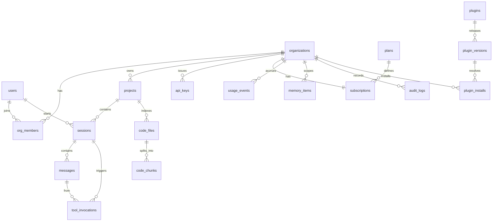

# 3. ERD & 4. DB Schema

실제 DDL은 [infra/migrations/0001_init.sql](../infra/migrations/0001_init.sql) 참조. 이 문서는 모델링 결정의 이유를 설명한다.

## 3.1 ERD

## 4.1 모델링 결정

**테넌시 축 = organization.** 개인 사용자도 1인 org로 취급한다. 이유: "개인→팀 전환"이 흔한 성장 경로인데, user 기준으로 스키마를 짜면 전환 시 전 테이블 마이그레이션이 필요하다. 처음부터 org로 통일하면 전환은 멤버 추가일 뿐이다.

**users.id = Supabase auth.users.id 미러.** 인증은 Supabase, 프로필/조인은 우리 스키마. FK 무결성을 우리 DB 안에서 유지하기 위해 미러 테이블을 둔다(웹훅/첫 로그인 시 upsert).

**messages.content = jsonb.** 텍스트만이 아니라 tool_call, tool_result, 이미지 참조 등 콘텐츠 블록 배열을 담는다. 정규화(블록별 테이블)는 조회 패턴(세션 단위 전체 로드)과 맞지 않아 기각.

**memory_items의 3중 스코프 (org_id, user_id?, project_id?).** 메모리는 "누구의 기억인가"가 핵심이다. user_id null = 조직 공유 지식, project_id null = 프로젝트 무관 선호. 스코프 조합으로 recall 시 가시성 필터가 SQL where 절 하나로 끝난다.

**code_chunks에 embedding + tsvector 동시 보유.** RAG는 벡터 단독보다 하이브리드(벡터+키워드 RRF 융합)가 코드 검색에서 확실히 우수하다 — 식별자 완전일치(예: `getUserById`)는 BM25/tsv가, 의미 검색은 벡터가 잡는다. generated column으로 tsv를 자동 유지해 애플리케이션 코드의 이중 쓰기 버그를 원천 차단.

**usage_events = append-only + bigserial.** 과금의 원장(ledger)이다. update 금지, 집계는 파생 뷰로. 분쟁 시 재계산 가능해야 하기 때문. 월별 파티셔닝은 1억 행 도달 전에 적용(pg_partman).

**api_keys는 해시만 저장.** 평문 키는 발급 순간 한 번만 노출. `key_prefix`는 대시보드 표시용. 유출 시 폭발 반경을 줄이기 위해 scopes 배열로 키별 권한 제한.

**plugin_versions.bundle_sha256 + signature.** 마켓플레이스 공급망 공격 방어: 설치 시 번들 해시 검증 + ed25519 서명 검증. 레지스트리가 탈취되어도 서명 키 없이는 악성 번들을 밀어넣을 수 없다.

## 4.2 인덱스 전략

| 인덱스 | 근거 |
|---|---|
| `messages (session_id, created_at)` | 유일한 조회 패턴: 세션 타임라인 |
| `memory_items` HNSW cosine | recall은 항상 스코프 필터 + 벡터 정렬 |
| `code_chunks` HNSW + GIN(tsv) | 하이브리드 검색의 양 날개 |
| `usage_events (org_id, created_at)` | 월별 쿼터 집계 쿼리 전용 |
| `sessions (org_id, user_id, updated_at desc)` | 세션 목록 = 최근순 |

HNSW 파라미터 `m=16, ef_construction=64`: 재현율 95%+ 와 빌드 시간의 균형점. 인덱싱은 백그라운드 잡이라 빌드 시간보다 쿼리 지연이 우선.
