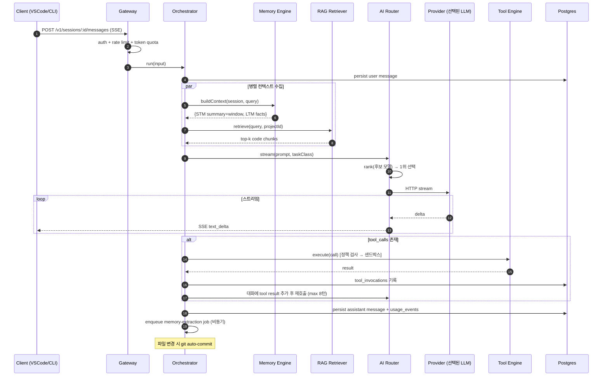
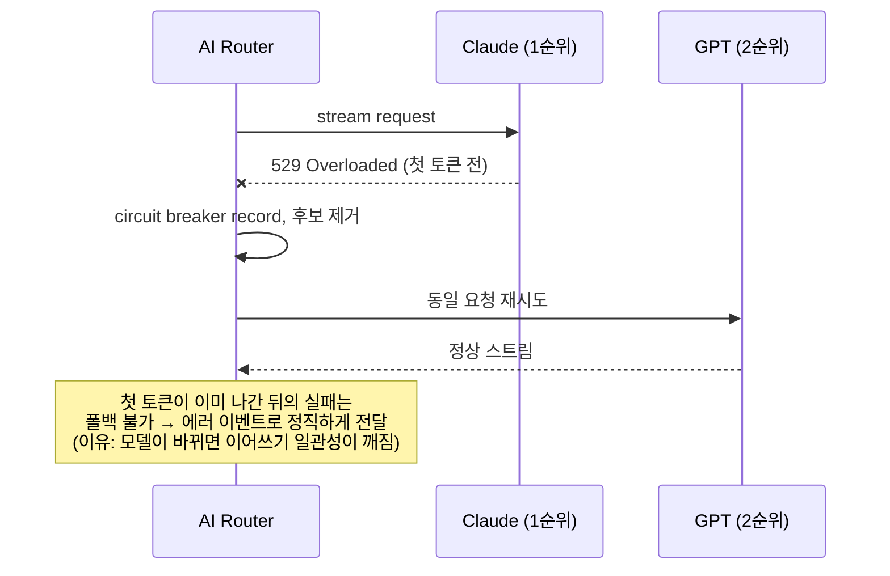
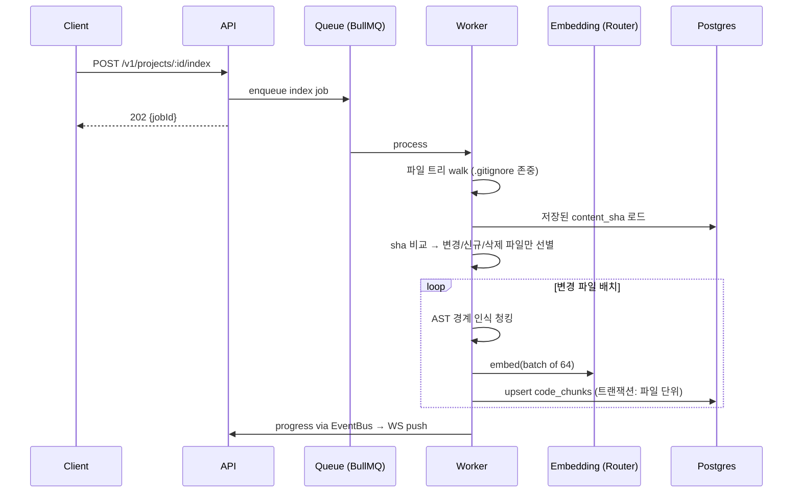
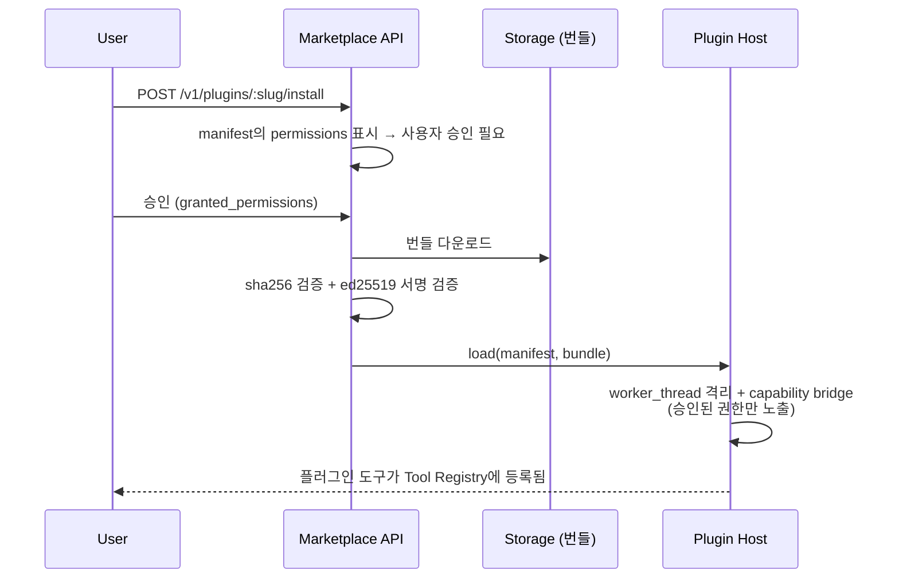
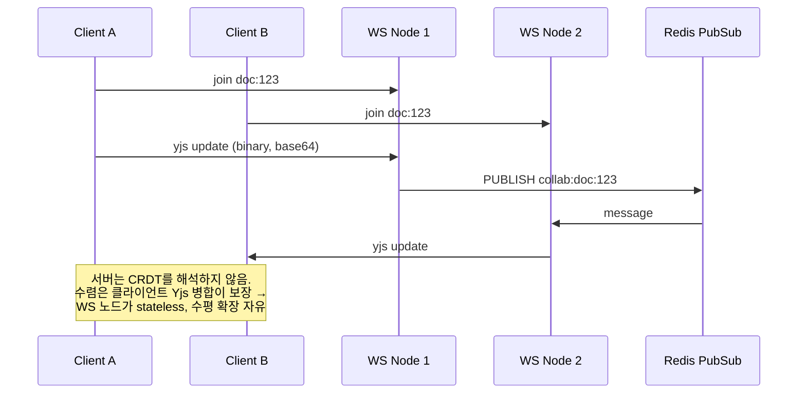

# 5. Sequence Diagrams

## 5.1 채팅 + 도구 호출 + 메모리 (핵심 루프)

설계 포인트: 메모리/RAG 조회를 병렬화(3~4단계)해 첫 토큰 지연(TTFT)에 더해지는 오버헤드를 max(두 조회)로 억제. 메모리 추출은 응답 경로에서 제외(비동기 잡) — 사용자 지연에 LLM 추출 비용을 전가하지 않는다.

## 5.2 스트림 중 프로바이더 장애 → 폴백

## 5.3 코드베이스 인덱싱 (증분)

파일 단위 sha 비교가 핵심: 저장 커밋마다 전체 재인덱싱하면 임베딩 비용이 프로젝트 크기에 비례해 반복 발생한다. 증분화로 일상 비용을 변경분에 비례하게 만든다.

## 5.4 플러그인 설치 (마켓플레이스)

## 5.5 실시간 협업 (Yjs relay)

